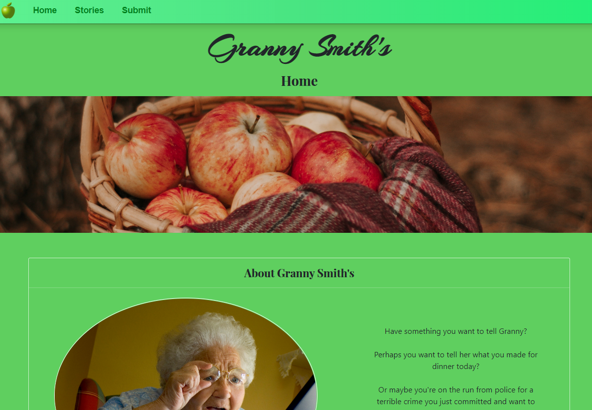
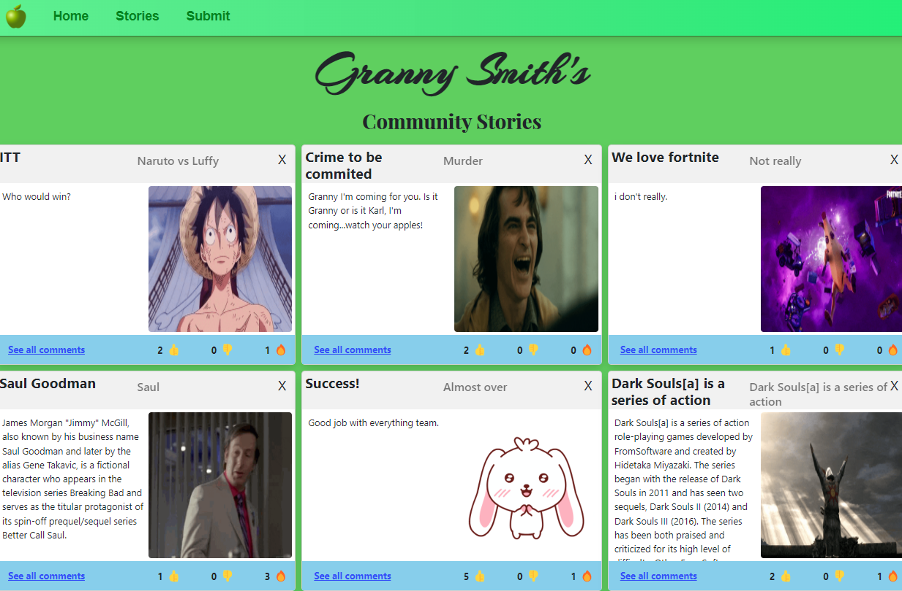
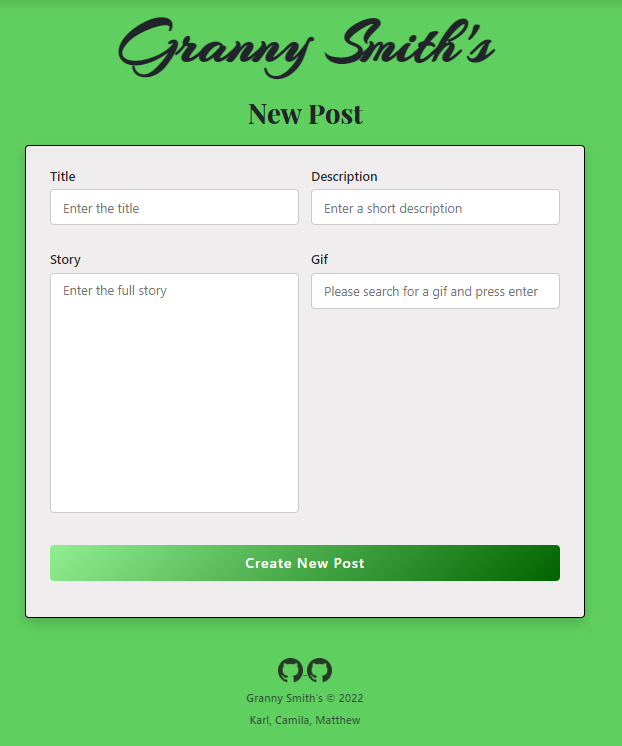
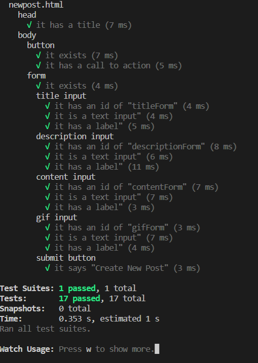
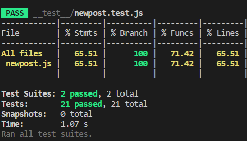

# Granny Smith's Message Board (Client)


## Project Description
The aim of the project was to build a community journaling website that allows users to anonomously post and respond to stories.
## Table of contents
1. [Installation](/README.md#installation)
2. [Technologies](/README.md#technologies)
3. [Website Preview](/README.md#website-preview)
4. [Process](/README.md#process)
5. [Wins & Challenges](/README.md#wins--challenges)
6. [Code Snippets](/README.md#code-snippets)
7. [Testing](/README.md#testing)
8. [Future Features](/README.md#future-features)
9. [License](/README.md#license)
10. [Contributers](/README.md#contributers)

## Installation
* Clone or download the [repo](https://github.com/karldudley/blog_project_client).
* Within the terminal, navigate to the project folder.
* Run ```npm install``` to install all required dependecies.

### *To run locally:*

From index.html, start a live server and the website should be running locally.

### *For the deployed site:*
The deployed web site can be found on [netlify](https://granny-smith-journal.netlify.app/pages/index.html).

## Technologies
* HTML / CSS
* JavaScript
### *Planning*
* [Trello](https://trello.com/b/0B0TxqB0/online-journal)
* Excalidraw
* Zoom/Slack
### *Dependecies*
* Jest
* Jest Environment JSDOM
* Watchify
* Nodemon

## Website Preview
### *Homepage*


### *All Posts*


### *New Post*


## Process
- We started by creating a mock-up of the client website layout using Excalidraw.
- We decided that the website would have three pages: i) Home, ii) All Posts and iii) New Post.
- With a rough overview complete, we discussed what tasks we would focus on. The main tasks we identified were:
  - Create a consistent look and feel for the website with a common navigation bar, header and footer.
  - All Posts page - we decided to utilise bootstrap cards and our own custom styling to display the posts.
  - New Post entry form - this would need to make GET requests to the giphy api and POST requests to our server.
- Tasks were kept track of on a kanban board using Trello.
- As soon as we had a very basic website by the end of the first day, we deployed to Netlify from our GitHub repo’s staging branch. This meant we were able to consistently view the changes we were making and test accordingly.
- We communicated regularly over Slack and Zoom to monitor our progress and help each other overcome issues. This included a daily standup.
- As we wrote the client code, we tested the html layout and javascript functions using Jest in node.js.
- After the bulk of the client website had been built, the next task was to integrate it with the server. At this point we began to work a lot more closely as a team to ensure client and server code worked together smoothly.
- With the main functionality (ability to make new posts and view them) in place, we turned our attention to extra features like comments and emojis. This required some extra server routes to be added. Similar to the cards on the All Posts page, these were generated dynamically using Javascript.
- We did extensive user testing to identify bugs and made fixes. For example, we realised that long strings with no spaces displayed incorrectly but we found a fix using the CSS word-break attribute.
- Some final adjustments were made to the styling and a few media queries were added to adjust the layout of the cards when the screen size changed.

## Wins & Challenges
### *Wins*
1. The layout of the New Post form is clean and professional. It checks that all required fields have data before submitting and limits the number of characters. The gif search is user-friendly as they only need to press enter and the gif appears. When the gif appears it is in line with the rest of the form. The text field borders change colour when they are in focus or validated. The submit button has a nice hover effect. Finally, the fetch requests to the giphy api and server work and the page redirects to All Posts once submitted.
2. The way the cards are dynamically generated on the All Posts page using Javascript. Based on the data stored within the server, the page will load however many elements it needs to accommodate for each post object. This makes it possible for the server to have hundreds of different post objects without causing any issues on the client side. It also orders the posts based on the most recently inserted object, so things that just get posted will have much more visibility than older posts.
3. Retrieval of comments and emoji count. The website successfully retrieves and loads this data on the client side, with it also looking professional. This data is initially fetched from the server, then is sent back to the server if there is any new information from the client. This makes it so that the data is accurate for other people if more were to use the site as well.
4. Testing is able to provide a coverage of over 60%.

### *Challenges*
1. When the delete function was added, initially it appeared to work. However, during testing, a bug was found that sometimes the wrong post was deleted on the server. Following an investigation, it was found that this was caused by the post ID values getting out of sync with their position in the array. To solve this, we reassigned the ID values using a for loop after each deletion. We also added Javascript confirmation dialog boxes to double-check with the user that they really wanted to delete the post.
2. When we thought we had everything working, suddenly the New Post page started producing 500 Internal Server errors on submission. This was caused by having no objects in the post array. Restarting the server fixed it and we added an alert to stop users deleting the final post. A better fix could be added in the future and would involve improved error handling between client and server.

## Code Snippets
### *New Post Form - HTML*
```
<form autocomplete="off">
    <div class="story-details">
        <div class="input-box" id="A">
            <label class="details" for="titleForm">Title</label>
            <input id="titleForm" type="text" placeholder="Enter the title" required maxlength="35">
        </div>
        <div class="input-box" id="B">
            <label class="details" for="descriptionForm">Description</label>
            <input id="descriptionForm" type="text" placeholder="Enter a short description" required maxlength="35">
        </div>
        <div class="input-box" id="C">
            <label class="details" for="contentForm">Story</label>
            <textarea id="contentForm" required placeholder="Enter the full story" maxlength="350"></textarea>
        </div>
        <div class="input-box" id="D">
        <label class="details" for="gifForm">Gif</label>
            <input id="gifForm" type="text" placeholder="Please search for a gif and press enter" required maxlength="35">
        </div>
        <h1 style="display:none"></h1>
        <div class="input-box" id="E">           
        </div>
    </div>
    <div class="button">
        <input type="submit" value="Create New Post">
    </div>
</form>
```
### *New Post Form - CSS*
```
form .button {
    height: 45px;
    margin: 45px 0;
}
form .button input {
    height: 100%;
    width: 100%;
    outline: none;
    color: white;
    border: none;
    font-size: 18px;
    font-weight: 600;
    border-radius: 5px;
    letter-spacing: 1px;
    background: linear-gradient(135deg, lightgreen, darkgreen);
}
form .button input:hover {
    background: linear-gradient(-135deg, lightgreen, darkgreen);
    cursor: pointer;
```
### *New Post Form - JavaScript*
```
function findGif (ev) {
  if (ev.key === 'Enter') {
    ev.preventDefault(); //to stop the page reload

    let url = `https://api.giphy.com/v1/gifs/search?rating=g&api_key=${APIKEY}&limit=1&q=`;
    let str = document.getElementById("gifForm").value.trim();
    url = url.concat(str);

    fetch(url)
      .then(response => response.json())
      .then(content => {
        let gifDiv = document.getElementById("E")
        let img = document.createElement("img");
        let gifURL = document.querySelector("form .story-details h1")
        gifURL.textContent = content.data[0].images.downsized.url
        img.src = content.data[0].images.downsized.url;
        img.alt = content.data[0].title;
        gifDiv.textContent="";
        gifDiv.appendChild(img);
      })
      .catch(err => {
        console.error(err);
      });
  }
}
```
## Testing
#### We used Jest and the Jest Environment JSDOM dependencies to test our client.
### *Layout Testing*


### *Function Testing*


## Future Features
- Ability to add ‘heat’ to the posts. We are already tracking thumbs up, down and favourites so we could use this data to order the posts based on which ones are the most popular and/or commented. This would help to drive engagement with the website as the ‘cream would rise to the top’.
- Use of cookies to track what users have already viewed and reacted to. This would prevent them reacting more than once to individual posts.

## License
## 

## Contributors

### [Matthew Blackman](https://github.com/ultimafinal1)
### [Camila Pessoa](https://github.com/Nevashka)
### [Karl Dudley](https://github.com/karldudley)

#### Server side can be found [here](https://github.com/karldudley/blog_project_server/tree/staging)
